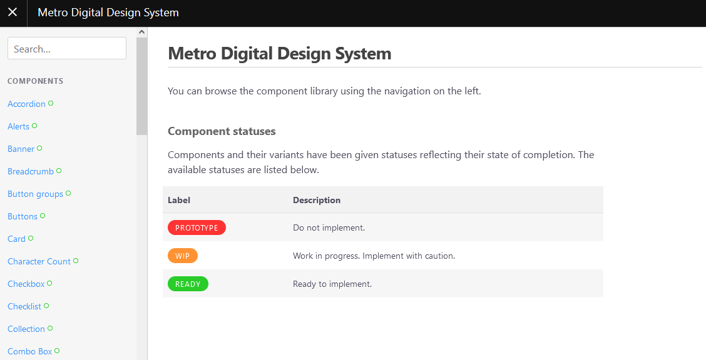

# Digital Design System

The Metro Digital Design System is a collection of components that are designed to be used in conjunction with digital Metro Projects. The purpose is to re-use and streamline the development of Metro websites.


## How to use

You should include both the CSS and JavaScript files in order to use this Digital Design System.

### CSS

``` html
<link rel="stylesheet" href="https://lacmta.github.io/design-system/dist/css/uswds.min.css" type="text/css">
```

### JavaScript 

```
<script src="https://lacmta.github.io/design-system/dist/js/uswds.min.js"></script>
<script src="https://lacmta.github.io/design-system/dist/js/uswds-init.min.js"></script>
```

The following website lists the supported components to use in your application.



[https://lacmta.github.io/design-system/build/](https://lacmta.github.io/design-system/build/)

## Contributing

If you'd like to contribute to the Digital Design System, please visit the [Action Group page](working_groups/digital_design_system/) or feel free to contribute to the [GitHub repository](https://github.com/LACMTA/design-system/).